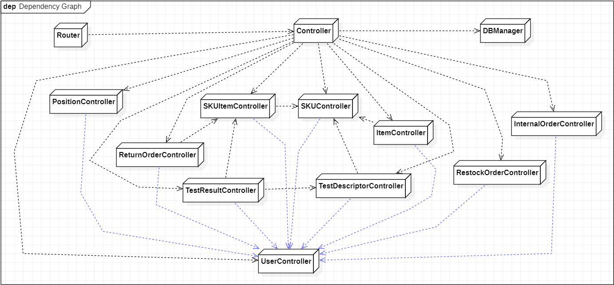

# Integration and API Test Report

Date: 25/05/2022

Version: 1.0

# Contents

- [Dependency graph](#dependency graph)

- [Integration and API Test Report](#integration-and-api-test-report)
- [Contents](#contents)
- [Dependency graph](#dependency-graph)
- [Integration approach](#integration-approach)
- [Integration Tests](#integration-tests)
  - [Restock Orders Controllers Test Suite](#restock-orders-controllers-test-suite)
  - [Return Orders Controllers Test Suite](#return-orders-controllers-test-suite)
  - [Internal Orders Controllers Test Suite](#internal-orders-controllers-test-suite)
  - [SkuItem Controller Test Suite](#skuitem-controller-test-suite)
  - [Position Controller Test Suite](#position-controller-test-suite)
  - [Test Suite n](#test-suite-n)
- [Coverage of Scenarios and FR](#coverage-of-scenarios-and-fr)
- [Coverage of Non Functional Requirements](#coverage-of-non-functional-requirements)
    - 

- [Tests](#tests)

- [Scenarios](#scenarios)

- [Coverage of scenarios and FR](#scenario-coverage)
- [Coverage of non-functional requirements](#nfr-coverage)

# Dependency graph 

     
# Integration approach
To implement Integration tests we have used a mixed approach between Top-Down and Bottom-Up, this is because our Integration and Unit Tests are merged together in several test suites.
The reason of this choice is that in our Unit Tests we were obliged to test together more than one class (it'd have been useless to test only a single Controller that can't perform any operation without the database) at a time because of our application design, which is in contrast with the definition of "Unit Test".

    

#  Integration Tests

   <define below a table for each integration step. For each integration step report the group of classes under test, and the names of
     Jest test cases applied to them, and the mock ups used, if any> Jest test cases should be here code/server/unit_test

## Restock Orders Controllers Test Suite 
| Classes                                                  | Jest test cases                                             |
| -------------------------------------------------------- | ----------------------------------------------------------- |
| controller.js - restockOrderController.js - dbManager.js | test("Successfully add new Restock Order to Database")      |
| controller.js - restockOrderController.js - dbManager.js | test("Insertion of a RestockOrder with malformed date")     |
| controller.js - restockOrderController.js - dbManager.js | test("Insertion of a RestockOrder with invalid supplierId") |
| controller.js - restockOrderController.js - dbManager.js | test('Successfully edit a Restock Order')                   |
| controller.js - restockOrderController.js - dbManager.js | test('Edit a Restock Order with an invalid state')          |
| controller.js - restockOrderController.js - dbManager.js | test('Edit a non-existing Restock Order')                   |
| controller.js - restockOrderController.js - dbManager.js | test('Successfully delete a Restock Order')                 |
| controller.js - restockOrderController.js - dbManager.js | test('Delete a non-existing Restock Order')                 |

## Return Orders Controllers Test Suite
| Classes                                                 | Jest test cases                                                          |
| ------------------------------------------------------- | ------------------------------------------------------------------------ |
| controller.js - returnOrderController.js - dbManager.js | test('Successfully create a new Return Order')                           |
| controller.js - returnOrderController.js - dbManager.js | test('Creation of a Return Order with an invalid Restock Order id'       |
| controller.js - returnOrderController.js - dbManager.js | test('Creation of a Return Order with an invalid date'                   |
| controller.js - returnOrderController.js - dbManager.js | test('Creation of a Return Order with one or more non-existing products' |
| controller.js - returnOrderController.js - dbManager.js | test('Successfully delete a Return Order'                                |
| controller.js - returnOrderController.js - dbManager.js | test('Delete a non-existing Return Order')                               |

## Internal Orders Controllers Test Suite
| Classes                                                   | Jest test cases                                                |
| --------------------------------------------------------- | -------------------------------------------------------------- |
| controller.js - internalOrderController.js - dbManager.js | test("Successfully add a new Internal Order to Database")      |
| controller.js - internalOrderController.js - dbManager.js | test("Insertion of an Internal Order with malformed date")     |
| controller.js - internalOrderController.js - dbManager.js | test("Insertion of an Internal Order with invalid customerId") |
| controller.js - internalOrderController.js - dbManager.js | test("Successfully edit an Internal Order")                    |
| controller.js - internalOrderController.js - dbManager.js | test("Edit an Internal Order with an invalid state")           |
| controller.js - internalOrderController.js - dbManager.js | test("Edit a non-existing Internal Order")                     |
| controller.js - internalOrderController.js - dbManager.js | test("Successfully delete an Internal Order")                  |
| controller.js - internalOrderController.js - dbManager.js | test("Delete a non-existing Internal Order")                   |

## SkuItem Controller Test Suite

   
| Classes                                             | Jest test cases                                                   |
| --------------------------------------------------- | ----------------------------------------------------------------- |
| controller.js - skuItemController.js - dbManager.js | test('successfull use of getAllSkuItems')                         |
| controller.js - skuItemController.js - dbManager.js | test('successfull use of getSkuItems')                            |
| controller.js - skuItemController.js - dbManager.js | test('attempt to use getSkuItems with a non-existant skuid')      |
| controller.js - skuItemController.js - dbManager.js | test('attempt to use getSkuItems with a invalid skuid')           |
| controller.js - skuItemController.js - dbManager.js | test('successfull use of getSkuItem')                             |
| controller.js - skuItemController.js - dbManager.js | test('attempt to use getSkuItem with a non-existant rfid')        |
| controller.js - skuItemController.js - dbManager.js | test('attempt to use getSkuItem with an invalid rfid')            |
| controller.js - skuItemController.js - dbManager.js | test('successful use of createSku and createSKUitem')             |
| controller.js - skuItemController.js - dbManager.js | test('attempt to create SkuItem with non-existent SKUId')         |
| controller.js - skuItemController.js - dbManager.js | test('attempt to create SkuItem with invalid rfid')               |
| controller.js - skuItemController.js - dbManager.js | test('attempt to create SkuItem with an already used rfid')       |
| controller.js - skuItemController.js - dbManager.js | test('attempt to create SkuItem with invalid SKUId')              |
| controller.js - skuItemController.js - dbManager.js | test('attempt to create SkuItem with invalid date')               |
| controller.js - skuItemController.js - dbManager.js | test('successful use of createSkuItem and editSkuItem')           |
| controller.js - skuItemController.js - dbManager.js | test('attempt to edit a non-existant SkuItem')                    |
| controller.js - skuItemController.js - dbManager.js | test('attempt to edit a SkuItem with an invalid rfid')            |
| controller.js - skuItemController.js - dbManager.js | test('attempt to edit a SkuItem with an invalid available value') |
| controller.js - skuItemController.js - dbManager.js | test('attempt to edit a SkuItem with an invalid date')            |
| controller.js - skuItemController.js - dbManager.js | test('successful use of createSkuItem and deleteSkuItem')         |
| controller.js - skuItemController.js - dbManager.js | test('attempt to delete a SkuItem with an invalid rfid')          |

## Position Controller Test Suite 

   
| Classes                                              | Jest test cases                                                    |
| ---------------------------------------------------- | ------------------------------------------------------------------ |
| controller.js - positionController.js - dbManager.js | test('successfully use of getAllPositions')                        |
| controller.js - positionController.js - dbManager.js | test('successfully use of createPosition')                         |
| controller.js - positionController.js - dbManager.js | test('attempt of createPosition with invalid PositionID')          |
| controller.js - positionController.js - dbManager.js | test('attempt of createPosition with incompatible position codes') |
| controller.js - positionController.js - dbManager.js | test('attempt of createPosition with an undefined parameter')      |
| controller.js - positionController.js - dbManager.js | test('attempt of createPosition with negative weight')             |
| controller.js - positionController.js - dbManager.js | test('attempt of createPosition with negative volume')             |
| controller.js - positionController.js - dbManager.js | test('successful use of editPositionVer1')                         |
| controller.js - positionController.js - dbManager.js | test('attempt of editPositionVer1 with an invalid positionID')     |
| controller.js - positionController.js - dbManager.js | test('attempt of editPositionVer1 with non-existant position')     |
| controller.js - positionController.js - dbManager.js | test('attempt of editPositionVer1 with invalid position codes')    |
| controller.js - positionController.js - dbManager.js | test('attempt of editPositionVer1 with negative weight')           |
| controller.js - positionController.js - dbManager.js | test('attempt of editPositionVer1 with negative volume')           |
| controller.js - positionController.js - dbManager.js | test('attempt of editPositionVer1 with negative occupiedWeight')   |
| controller.js - positionController.js - dbManager.js | test('attempt of editPositionVer1 with negative occupiedVolume')   |
| controller.js - positionController.js - dbManager.js | test('successful use of editPositionVer2')                         |
| controller.js - positionController.js - dbManager.js | test('attempt of editPositionVer2 with a non-existant position')   |
| controller.js - positionController.js - dbManager.js | test('attempt of editPositionVer2 with an invalid oldPositionID')  |
| controller.js - positionController.js - dbManager.js | test('attempt of editPositionVer2 with an invalid newPositionID')  |
| controller.js - positionController.js - dbManager.js | test('successful use of deletePosition')                           |
| controller.js - positionController.js - dbManager.js | test('attempt of deletePosition with invalid positionId')          |
| controller.js - positionController.js - dbManager.js | test('successful use of checkPositionID')                          |
| controller.js - positionController.js - dbManager.js | test('attempt of checkPositionID with invalid PositionID')         |
| controller.js - positionController.js - dbManager.js | test('attempt of checkPositionID with invalid aisleID')            |
| controller.js - positionController.js - dbManager.js | test('attempt of checkPositionID with invalid row')                |
| controller.js - positionController.js - dbManager.js | test('attempt of checkPositionID with invalid col')                |
| controller.js - positionController.js - dbManager.js | test('attempt of checkPositionID with incompatible codes')         |

## Test Suite n 

   
| Classes | Jest test cases |
| ------- | --------------- |
|         |                 |

# Coverage of Scenarios and FR

<Report in the following table the coverage of  scenarios (from official requirements and from above) vs FR. 
Report also for each of the scenarios the (one or more) API Mocha tests that cover it. >  Mocha test cases should be here code/server/test

| Scenario ID   | Functional Requirements covered | Mocha  Test(s)                                      |
| ------------- | ------------------------------- | --------------------------------------------------- |
| 3-1, 3-2      | FR 5.1, 5.2, 5.3, 5.5           | Succesfully add and get a new Restock Order         |
| 3-1, 3-2      | FR 5.2, 5.3                     | Successfully add a list of SKUItems                 |
| 3             | FR 5.6                          | Successfully add a transportNote to a Restock Order |
| 5-2-1 - 5-2-3 | FR 5.7                          | Edit restock order state                            |
| /             | FR 5                            | Successfully delete a Restock Order                 |
| 6             | FR 5.9                          | Successfully create a new Return Order              |
| 6             | FR 5.11                         | Successfully delete a Return Order                  |
| 9.1           | FR 6                            | Successfully add a new Internal Order               |
| 9.3           | FR 6                            | Successfully delete an internal order               |
| 11.1          | FR 7                            | Successfully add a new Item                         |
| 11.2          | FR 7                            | Successfully edit an Item                           |
| ...           |                                 |                                                     |

# Coverage of Non Functional Requirements

<Report in the following table the coverage of the Non Functional Requirements of the application - only those that can be tested with automated testing frameworks.>

### 

| Non Functional Requirement | Test name                                                              |
| -------------------------- | ---------------------------------------------------------------------- |
| NFR2                       | All                                                                    |
| NFR3                       | All                                                                    |
| NFR4                       | RestockOrderAPITest.js, ReturnOrderAPITest.js                          |
| NFR6                       | RestockOrderAPITest.js, ReturnOrderAPITest.js,                         |
| NFR9                       | InternalOrderAPITest.js, RestockOrderAPITest.js, ReturnOrderAPITest.js |
