# Design Document 

Authors: 

Date:

Version:

# Contents

- [Design Document](#design-document)
- [Contents](#contents)
- [Instructions](#instructions)
- [High level design](#high-level-design)
- [Low level design](#low-level-design)
  - [Logic Class Diagram](#logic-class-diagram)
  - [Data Class Diagram](#data-class-diagram)
- [Verification traceability matrix](#verification-traceability-matrix)
- [Verification sequence diagrams](#verification-sequence-diagrams)
  - [Sequence Diagram 1.1](#sequence-diagram-11)
  - [Sequence Diagram 3.1](#sequence-diagram-31)
  - [Sequence Diagram 4.1](#sequence-diagram-41)
  - [Sequence Diagram 5.1.1](#sequence-diagram-511)
  - [Sequence Diagram 5.2.1](#sequence-diagram-521)
  - [Sequence Diagram 6.1](#sequence-diagram-61)
  - [Sequence Diagram 9.1](#sequence-diagram-91)
  - [Sequence Diagram 12.1](#sequence-diagram-121)

# Instructions

The design must satisfy the Official Requirements document, notably functional and non functional requirements, and be consistent with the APIs

# High level design 

<discuss architectural styles used, if any>
<report package diagram, if needed>

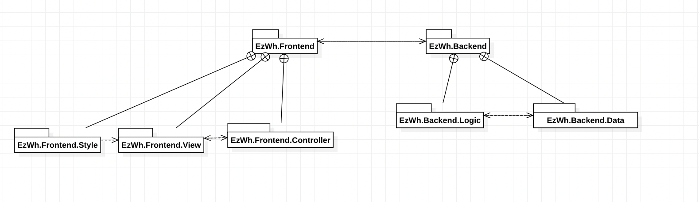

# Low level design

<for each package in high level design, report class diagram. Each class should detail attributes and operations>

## Logic Class Diagram
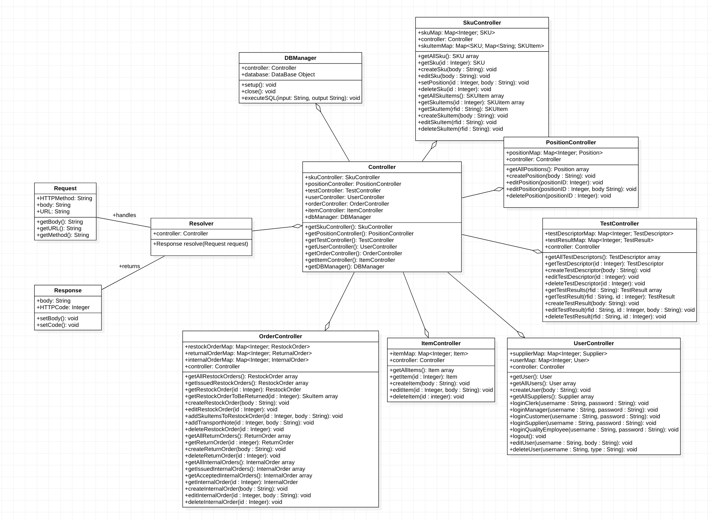

## Data Class Diagram
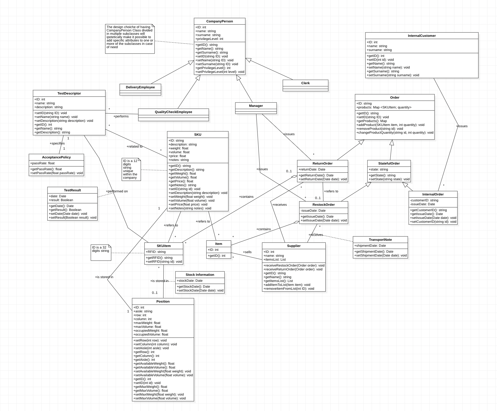

# Verification traceability matrix

\<for each functional requirement from the requirement document, list which classes concur to implement it>

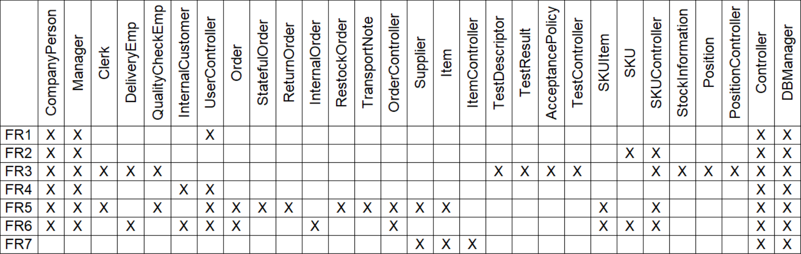

# Verification sequence diagrams 
\<select key scenarios from the requirement document. For each of them define a sequence diagram showing that the scenario can be implemented by the classes and methods in the design>

## Sequence Diagram 1.1

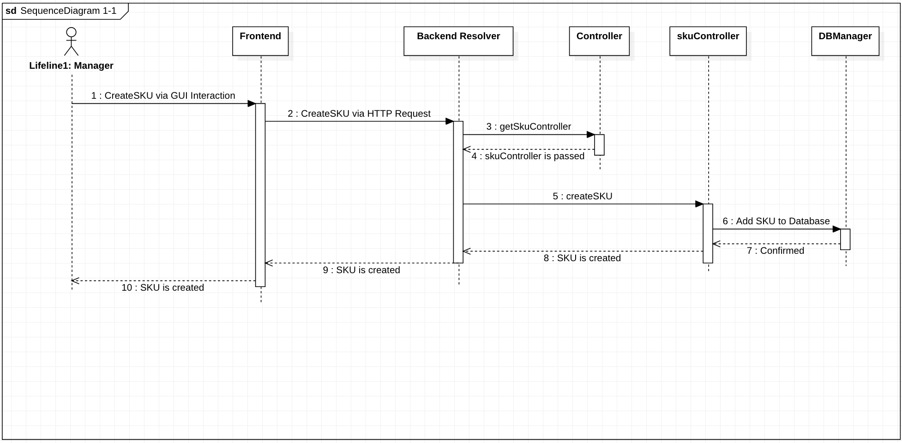

## Sequence Diagram 3.1

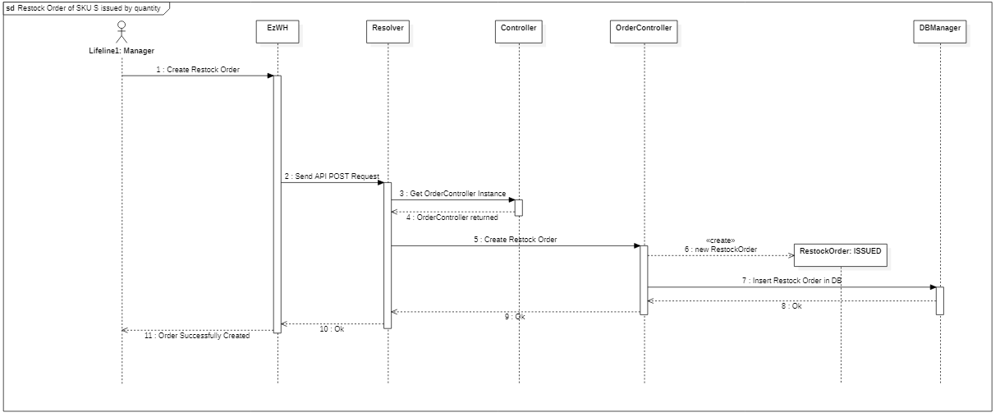

## Sequence Diagram 4.1

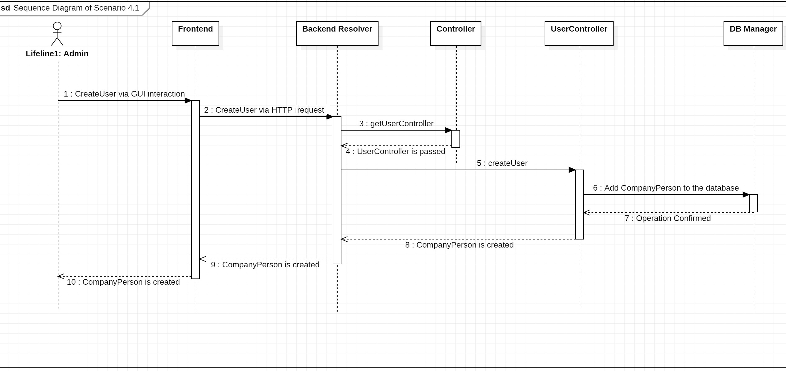

## Sequence Diagram 5.1.1
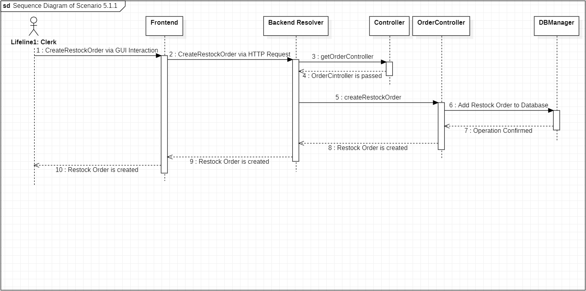

## Sequence Diagram 5.2.1

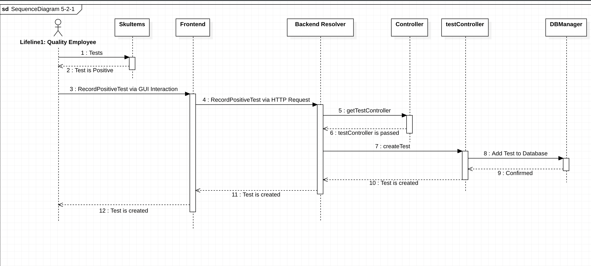

## Sequence Diagram 6.1

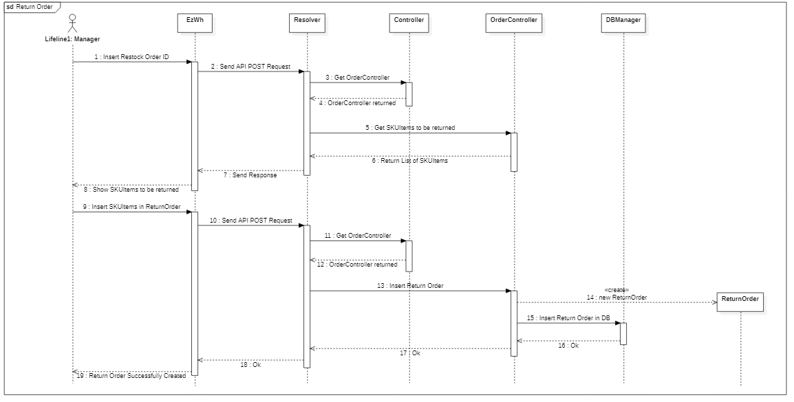

## Sequence Diagram 9.1

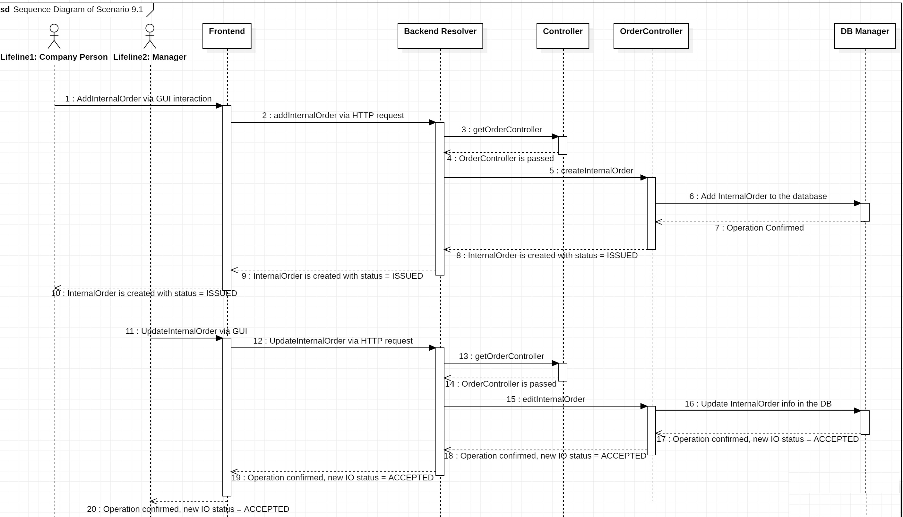

## Sequence Diagram 12.1

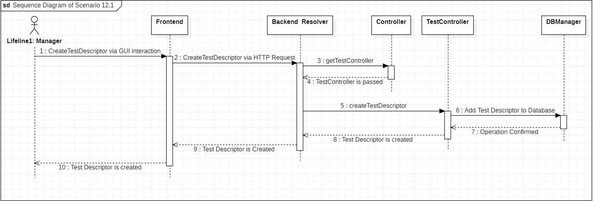

