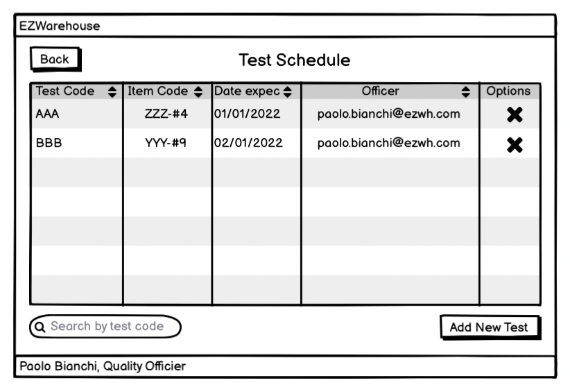
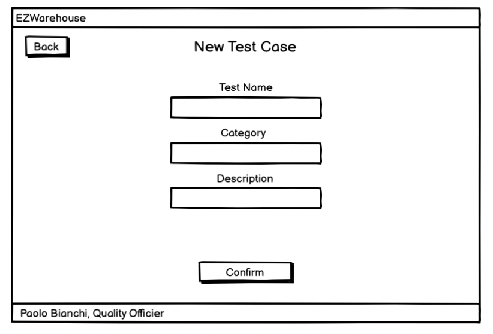
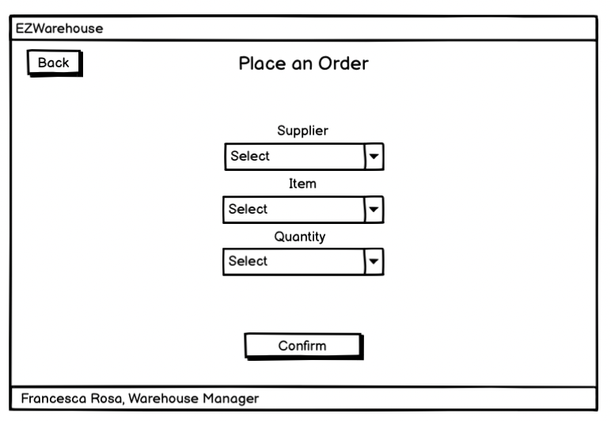
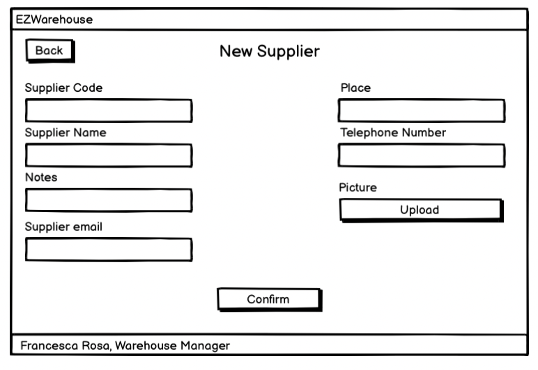
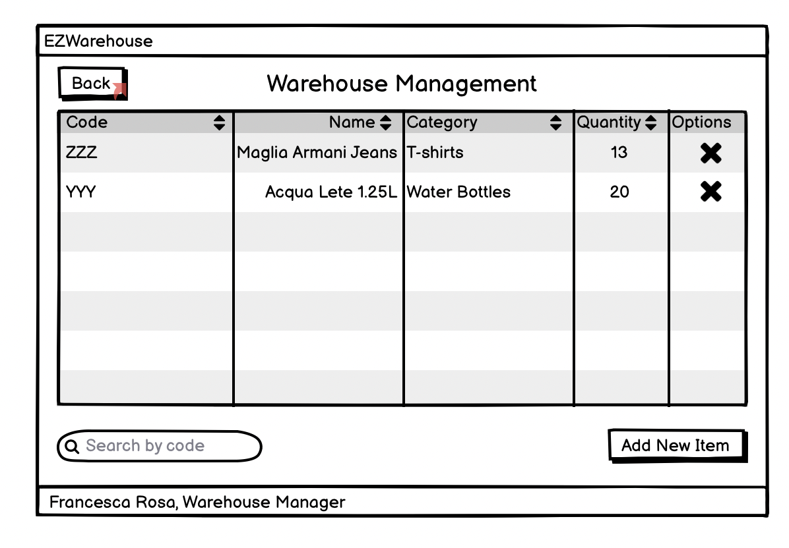

#Graphical User Interface Prototype  

Authors: Bianchi Giulia, Colella Edoardo, Colotti Manuel Enrique, Di Benedetto Giovanna

Date:

Version: 1.0

\<Report here the GUI that you propose. You are free to organize it as you prefer. A suggested presentation matches the Use cases and scenarios defined in the Requirement document. The GUI can be shown as a sequence of graphical files (jpg, png)  >

- [Gui wireframes](#gui-wireframes)
  - [Login](#login)
  - [Home](#home)
  - [Admin area](#admin-area)
    - [New user](#new-user)
    - [View user](#view-user)
    - [Delete user](#delete-user)
  - [Test Area](#test-area)
    - [Test History](#test-history)
      - [View Test Log](#view-test-log)
    - [Test Schedule](#test-schedule)
      - [View Test Schedule](#view-test-schedule)
      - [New Test Scheduling](#new-test-scheduling)
      - [Delete Test Schedule](#delete-test-schedule)
    - [Test Case Management](#test-case-management)
      - [New Test Case](#new-test-case)
      - [View Test Case](#view-test-case)
      - [Delete Test Case](#delete-test-case)
    - [Test Area - Mobile Version](#test-area---mobile-version)
  - [Order Area](#order-area)
    - [Internal Order](#internal-order)
    - [View Internal Order](#view-internal-order)
    - [Delete Internal Order](#delete-internal-order)
    - [Placing an order](#placing-an-order)
    - [External Order History](#external-order-history)
    - [Delete External Order](#delete-external-order)
    - [Suppliers List](#suppliers-list)
      - [Adding a Supplier](#adding-a-supplier)
    - [Suppliers List](#suppliers-list-1)
    - [Delete Supplier](#delete-supplier)
  - [Warehouse Management](#warehouse-management)
    - [New Item](#new-item)
    - [View Item By Code](#view-item-by-code)
    - [Inserting Item](#inserting-item)
    - [View Item](#view-item)
    - [Delete Item](#delete-item)
    - [Warehouse Area - Mobile Version](#warehouse-area---mobile-version)

# Gui wireframes

##  Login

In the login window, a warehouse user can insert email and password to login in the application. Eventually he can recover password clicking on *Forgot password?*. There is also a mobile version of the window.
 
##  Home

In the home window a user can access to the different areas of the applications. It is possibile to logout and the name and the role of the user are visibile in the right-down corner. There is also a mobile version of the window.

## Admin area

Accessing to the administration Area, with admin permissions, it is possible to view the user list of the applications. It is possible to select a user to view all the information, search a user by name, edit users' data, add a new user or delete an existing user. The confirm of a delete is asked by a Alert Dialog window. It is possible to go back to home window clicking *back* button.

### New user

An admin can add a user to the user list inserting all the needed informations.

### View user

An user can edit his own informations. An admin can edit informations about all users.

### Delete user

This window appears to ask confirm about the delete of a user. Only admins can delete a user.

## Test Area

### Test History

#### View Test Log

### Test Schedule

#### View Test Schedule

#### New Test Scheduling

#### Delete Test Schedule

### Test Case Management

#### New Test Case

#### View Test Case

#### Delete Test Case

### Test Area - Mobile Version

## Order Area

### Internal Order

### View Internal Order

### Delete Internal Order

### Placing an order

### External Order History

### Delete External Order 

### Suppliers List

#### Adding a Supplier

### Suppliers List

### Delete Supplier 

## Warehouse Management

### New Item

### View Item By Code

### Inserting Item

### View Item

### Delete Item

### Warehouse Area - Mobile Version

