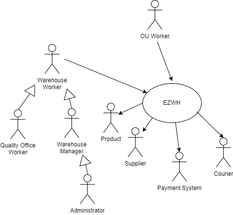
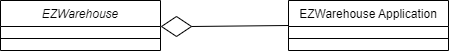
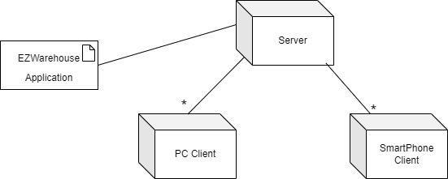

 #Requirements Document 

Date: 01 April 2022

Version: 2.0

 
| Version number | Change                                                                              							  |
| -------------- | :--------------------------------------------------------------------------------------------------------------|
| 1.0            | Definition of Stakeholders, functional requirements and non-functional requirements 						      |
| 2.0            | Definition of Use cases and scenarios                                               							  |
| 3.0            | Revision of Use cases and scenarios, Added draft of GUI, Context Diagram, System Design and Deployment Diagram |

# Contents

- [Contents](#contents)
- [Informal description](#informal-description)
- [Stakeholders](#stakeholders)
- [Context Diagram and interfaces](#context-diagram-and-interfaces)
	- [Context Diagram](#context-diagram)
	- [Interfaces](#interfaces)
- [Stories and personas](#stories-and-personas)
- [Functional and non functional requirements](#functional-and-non-functional-requirements)
	- [Functional Requirements](#functional-requirements)
	- [Non Functional Requirements](#non-functional-requirements)
- [Use case diagram and use cases](#use-case-diagram-and-use-cases)
	- [Use case diagram](#use-case-diagram)
	- [Use case 1, UC1 - Placement of an internal order](#use-case-1-uc1---placement-of-an-internal-order)
		- [Scenario 1.1](#scenario-11)
		- [Scenario 1.2](#scenario-12)
	- [Use case 2, UC2 - Placement of an external order](#use-case-2-uc2---placement-of-an-external-order)
		- [Scenario 2.1](#scenario-21)
		- [Scenario 2.2](#scenario-22)
		- [Scenario 2.3](#scenario-23)
	- [Use case 3, UC3 Track an item position and supply     (FR 2.1 - 2.5)](#use-case-3-uc3-track-an-item-position-and-supply-----fr-21---25)
	- [Use case 4, UC4 Collect an item  (FR 2.2 - 2.8)](#use-case-4-uc4-collect-an-item--fr-22---28)
	- [Use case 5, UC5 Select a free position in which to stock a new item   (FR 2.3 - 2.7)](#use-case-5-uc5-select-a-free-position-in-which-to-stock-a-new-item---fr-23---27)
	- [Use case 6, UC6 Issue a position replacement for an item](#use-case-6-uc6-issue-a-position-replacement-for-an-item)
		- [Scenario 6.1](#scenario-61)
		- [Scenario 6.2](#scenario-62)
		- [Scenario 6.3](#scenario-63)
	- [Use case 7, UC7 Prepare an item for delivery](#use-case-7-uc7-prepare-an-item-for-delivery)
		- [Scenario 7.1](#scenario-71)
		- [Scenario 7.2](#scenario-72)
	- [Use case 8, UC8 Elimination of an item from the warehouse](#use-case-8-uc8-elimination-of-an-item-from-the-warehouse)
	- [Use case 9, UC9 Placement of an item in the pickup area](#use-case-9-uc9-placement-of-an-item-in-the-pickup-area)
	- [Use case 10, UC10 - Create User Account](#use-case-10-uc10---create-user-account)
	- [Use case 11, UC11 - Modify user account](#use-case-11-uc11---modify-user-account)
	- [Use case 12, UC12 - Delete user account](#use-case-12-uc12---delete-user-account)
	- [Use case 13, UC13 - An item is quality tested](#use-case-13-uc13---an-item-is-quality-tested)
		- [Scenario 13.1](#scenario-131)
		- [Scenario 13.2](#scenario-132)
	- [Use case 15, UC15 - A test is modified](#use-case-15-uc15---a-test-is-modified)
	- [Use case 16, UC16 - A test is added](#use-case-16-uc16---a-test-is-added)
	- [Use case 17, UC17](#use-case-17-uc17)
	- [Use case 18, UC18](#use-case-18-uc18)
	- [Use case 19, UC19](#use-case-19-uc19)
- [Glossary](#glossary)
- [System Design](#system-design)
- [Deployment Diagram](#deployment-diagram)

# Informal description
Medium companies and retailers need a simple application to manage the relationship with suppliers and the inventory of physical items stocked in a physical warehouse. 
The warehouse is supervised by a manager, who supervises the availability of items. When a certain item is in short supply, the manager issues an order to a supplier. In general the same item can be purchased by many suppliers. The warehouse keeps a list of possible suppliers per item. 

After some time the items ordered to a supplier are received. The items must be quality checked and stored in specific positions in the warehouse. The quality check is performed by specific roles (quality office), who apply specific tests for item (different items are tested differently). Possibly the tests are not made at all, or made randomly on some of the items received. If an item does not pass a quality test it may be rejected and sent back to the supplier. 

Storage of items in the warehouse must take into account the availability of physical space in the warehouse. Further the position of items must be traced to guide later recollection of them.

The warehouse is part of a company. Other organizational units (OU) of the company may ask for items in the warehouse. This is implemented via internal orders, received by the warehouse. Upon reception of an internal order the warehouse must collect the requested item(s), prepare them and deliver them to a pick up area. When the item is collected by the other OU the internal order is completed. 

EZWH (EaSy WareHouse) is a software application to support the management of a warehouse.

# Stakeholders

| Stakeholder name                   |                                        Description                                        |
| ---------------------------------- | :---------------------------------------------------------------------------------------: |
| Medium Companies / Retailers       |                                                                                           |
| System Administrator               |                                                                                           |
| User Management System             |                                                                                           |
| Suppliers                          |   companies that supply items to the warehouse, hence to the warehouse's owner company    |
| Physical Warehouse                 |                                  items stocking facility                                  |
| Warehouse Items                    |                               items stocked in a warehouse                                |
| Warehouse Manager                  |                        person in charge of managing the warehouse                         |
| Items Ordering system              |                            system that manages incoming orders                            |
| Items Availability Checking System |                         system that checks availability of items                          |
| Items Collection System            |                        system that collects items to be delivered                         |
| Items Delivery System              |                 system that manages the delivery of items within an order                 |
| Warehouse worker                   |                                                                                           |
| Courier                            |                                                                                           |
| Quality Office                     |                            office that performs tests on items                            |
| Quality Checking System            |                    system that schedules tests and logs their outcomes                    |
| Quality Tests                      |                          tests for the different items)     !!!                           |
| Items Stocking System              |              system that manages the stocking in the warehouse of new items               |
| Items Returning System             | system that manages the returning of items that haven't passed one or more quality checks |
| Warehouse Space Management System  |             system that optimizes the space occupied by items in a warehouse              |
| Items Location Tracking System     |                    system that tracks items that have to be dispatched                    |
| Company Organizational Units       |                    sub-parts of the same company owning the warehouse                     |
| Internal Ordering System           |                   system that manages company-internal incoming orders                    |
| Payment System                     |                       system that handles the payment for an order                        |

# Context Diagram and interfaces

## Context Diagram

## Interfaces

| Actor              | Logical Interface | Physical Interface |
| ---------          | :-------------------------------------------------------------------------------------: | :----------------------------------: |
| Payment System     | API (https://stripe.com/docs/api)       												   | Internet link                       |
| Supplier           | Sends/receives email               													   | Internet link                       |
| Courirer           | Receives email                                                                          | Internet link                       |
| Product            | API for reading barcodes (https://developers.google.com/ml-kit/vision/barcode-scanning) | Mobile Phone Camera                 |
| Warehouse Worker   | GUI                                                                                     | Screen, keyboard and mouse on PC, touchscreen on smartphone|
| Warehouse Manager  | GUI                                                                                     | Screen, keyboard and mouse on PC, touchscreen on smartphone|
| QO Worker          | GUI                                                                                     | Screen, keyboard and mouse on PC, touchscreen on smartphone|
| OU Worker          | GUI                                                                                     | Screen, keyboard and mouse on PC, touchscreen on smartphone|
| Administrator      | GUI                                                                                     | Screen, keyboard and mouse on PC    |

# Stories and personas

Mark is a middle-aged man, he is the Warehouse Manager and has an inclination for order and discipline. When a product of a certain type is close to sold out, Mark reorders it. Mark is also very busy because of his position and work, he always gets home very late to fulfill his duties and he never has time to spend with his family. So Mark needs a fast and easy way to track the availability of a product, but he also needs an easy way to contact a supplier and perform the orders of the warehouse. Since he spends a lot of time in his office, he would like to have the opportuinity to perform all these kind of actions from the office PC.

Gina is a young woman, she is a normal part-time employee of the warehouse, and she has a really bad memory. When storing or removing a product, she would like to have a way to update the product's information without waiting to reach the office PC, since maybe she's going to forget it, so she would like to manage this kind of operations with her business phone as soon as possible.  

Albert is an old man, but he still works in the warehouse since he is part of a poor family. He wants to do his best in this work, so he'd like to have a tool that helps him in tracking in the most efficient way the warehouse products. Since he's old, he doesn't have great tech skills, so he would only be able to use an application with a basic user interface.

# Functional and non functional requirements

## Functional Requirements

\<In the form DO SOMETHING, or VERB NOUN, describe high level capabilities of the system>

\<they match to high level use cases> 

| ID  |        |         |           |                             Description                              |
| --- | ------ | ------- | --------- | :------------------------------------------------------------------: |
| FR1 |        |         |           |                        Placement of an Order                         |
|     | FR1.1  |         |           |                    Placement of an internal order                    |
|     |        | FR1.1.1 |           |                      Choice of the wanted item                       |
|     |        | FR1.1.2 |           |      Choice of the attributes for an item (quantity, color...)       |
|     |        | FR1.1.3 |           |                       Issue Order to warehouse                       |
|     |        | FR1.1.4 |           |                      Complete an internal order                      |
|     |        |         | FR1.1.4.1 |                           Log placed order                           |
|     | FR1.2  |         |           |                 Placement of an order to a supplier                  |
|     |        | FR1.2.1 |           |    Record info of a supplier (in case not already in the system)     |
|     |        | FR1.2.2 |           |        Choice of the supplier (in case already in the system)        |
|     |        | FR1.2.3 |           |                Fill information needed for the order                 |
|     |        | FR1.2.4 |           |               Check Availability of the requested item               |
|     |        | FR1.2.5 |           |        Handle payment of the items (external payment system)         |
|     |        | FR1.2.6 |           |                              Send order                              |
|     |        | FR1.2.7 |           |                      Complete an internal order                      |
|     |        |         | FR1.2.7.1 |                           Log placed order                           |
| FR2 |        |         |           |                 Management of the physical warehouse                 |
|     | FR2.1  |         |           |                    Check availability of an item                     |
|     | FR2.2  |         |           |                   Collect an item to be delivered                    |
|     | FR2.3  |         |           |         Select a free position in which to stock a new item          |
|     | FR2.4  |         |           |               Issue a position replacement for an item               |
|     | FR2.5  |         |           |                   Track an item by it's properties                   |
|     | FR2.6  |         |           |                     Prepare an item for delivery                     |
|     | FR2.7  |         |           |              Check space availability in the warehouse               |
|     | FR2.8  |         |           |                    Collect an item to be stocked                     |
|     | FR2.9  |         |           |              Elimination of an item from the warehouse               |
|     | FR2.10 |         |           |               Placement of an item in the pick-up area               |
| FR3 |        |         |           |                       Quality Tests Management                       |
|     | FR3.1  |         |           |                 Schedule a quality test for an item                  |
|     | FR3.2  |         |           |               Insert in the system a new quality test                |
|     | FR3.3  |         |           |            Insert outcome of a quality test in the system            |
|     | FR3.4  |         |           |                        Show outcome of a test                        |
|     | FR3.5  |         |           |        Modify parameters of a quality test (pass/reject rate)        |
|     | FR3.6  |         |           | Schedule return of an item in case of unfullfilled test requirements |
| FR4 |        |         |           |                         Inventory Management                         |
|     | FR4.1  |         |           |                   Add a new item to the inventory                    |
|     | FR4.2  |         |           |                  Remove an item from the inventory                   |
|     | FR4.3  |         |           |                         Edit info of an item                         |
|     | FR4.4  |         |           |                       Add supplier for an item                       |
|     | FR4.5  |         |           |                     Remove supplier for an item                      |
|     | FR4.6  |         |           |                      Edit supplier for an item                       |
|     | FR4.7  |         |           |             Track items to be placed in the pick-up area             |
| FR5 |        |         |           |                           Users Management                           |
|     | FR5.1  |         |           |                              Add a user                              |
|     | FR5.2  |         |           |                            Remove a user                             |
|     | FR5.3  |         |           |                     Manage permissions of a user                     |
|     | FR5.4  |         |           |                 Edit personal information of a user                  |
|     | FR5.5  |         |           |                      Show information of users                       |

## Non Functional Requirements

\<Describe constraints on functional requirements>

| ID    | Type (efficiency, reliability, ..) |                                                                  Description                                                                   | Refers to |
| ----- | :--------------------------------: | :--------------------------------------------------------------------------------------------------------------------------------------------: | --------: |
| NFR1  |             Usability              |                 The software must be easy to use also for employees which have a limited amount of knowledge in the IT domain                  |           |
| NFR2  |            Portability             |           In a company there might be different computers with different OS's, the software should be able to work in each of them.            |           |
| NFR3  |          Interoperability          |             The software should be able to cooperate with other software in order, for instance, to receive orders from suppliers              |           |
| NFR4  |       Easy to be maintained        |                     In order to avoid expensive down times, the software should be able to be fixed in case of sudden bugs                     |           |
| NFR5  |             Efficiency             | The software must be efficient in managing the operations of space optimization, collection, shipment and stocking of a large number of items. |           |
| NFR6  |            Scalability             |        If the company grows in dimensions (wrt the amount of sent and received orders), the software must be able to keep up and scale.        |           |
| NFR7  |             Robustness             |   The software must behave in a reasonable way also in case of unexpected scenarios (wrong inputs, bugs) in order to avoid economic damages    |           |
| NFR8  |                                    |                                 Nationality of companies that will use the software (multi-language platform)                                  |           |
| NFR9  |                                    |  Use of different measurement metrics in case the software will be used in different continents (i.e. currencies, distance, space, speed...)   |           |
| NFR10 |                                    |                                                   Consistency of data within the application                                                   |           |
| NFR11 |                                    |                                                          Privacy and Security of data                                                          |           |
| NFR12 |            Need-to-know            |                                        Every user has only the necessary information to perform his job                                        |           |
| NFR13 |          Least privilege           |                                 Every user has the necessary amount of privileges necessary to perform his job                                 |           |
| NFR14 |            Availability            |                                             (The order of defects in a year must be lower than 10)                                             |           |

# Use case diagram and use cases

## Use case diagram
\<define here UML Use case diagram UCD summarizing all use cases, and their relationships>

\<next describe here each use case in the UCD>

## Use case 1, UC1 - Placement of an internal order
| Actors Involved  |                                                            Manager, OU                                                             |
| ---------------- | :--------------------------------------------------------------------------------------------------------------------------------: |
| Precondition     |                                                     An item has to be ordered                                                      |
| Post condition   |                                                    The desired item is ordered                                                     |
| Nominal Scenario | The OU issues an order for the item (by selecting it and its attributes), the manager receives the order and the item is delivered |
| Variants         |                                                                                                                                    |
| Exceptions       |                        The item is not available; the item doesn't pass most of the tests that it has to do                        |

### Scenario 1.1

| Scenario 1.1   | Placement of internal order (item available)  |
| -------------- | :-------------------------------------------: |
| Precondition   |  The OU requests an item from the warehouse   |
| Post condition |           The OU receives the item            |
| Step#          |                  Description                  |
| 1              |    OU selects the item and its properties     |
| 2              |   The warehouse manager receives the order    |
| 3              |  The manager checks if the item is available  |
| 4              | The manager prepares the item to be delivered |
| 5              |             The item is delivered             |
| 6              |           The OU receives the item            |
| 7              |          Update history of the item           |
| ...            |                                               |

### Scenario 1.2
| Scenario 1.2   |  Placement of internal order (item unavailable)  |
| -------------- | :----------------------------------------------: |
| Precondition   |    The OU requests an item from the warehouse    |
| Post condition |         The OU doesn't receive the item          |
| Step#          |                   Description                    |
| 1              |      OU selects the item and its properties      |
| 2              |     The warehouse manager receives the order     |
| 3              |   The manager checks if the item is available    |
| 4              | The item is not available, the order is declined |
| ...            |                                                  |

## Use case 2, UC2 - Placement of an external order
| Actors Involved  |                                                             Manager, Supplier                                                             |
| ---------------- | :---------------------------------------------------------------------------------------------------------------------------------------: |
| Precondition     |                                                         An item has to be ordered                                                         |
| Post condition   |                                                        The desired item is ordered                                                        |
| Nominal Scenario | The manager issues an order for the item (by selecting it and its attributes), the suppliers receives the order and the item is delivered |
| Variants         |                                                                                                                                           |
| Exceptions       |         The item is not available; the supplier doesn't have the item; the item doesn't pass most of the tests that it has to do          |

### Scenario 2.1

| Scenario 2.1   |                  Placement of external order (item available, supplier already exists)                   |
| -------------- | :------------------------------------------------------------------------------------------------------: |
| Precondition   |                               The manager requests an item from a supplier                               |
| Post condition |                                      The manager receives the item                                       |
| Step#          |                                               Description                                                |
| 1              |                             the manager selects the item and its properties                              |
| 2              | The manager selects the supplier from which the item has to be received (from an already known supplier) |
| 3              |                                     The supplier receives the order                                      |
| 4              |                               The supplier checks if the item is available                               |
| 5              |                              The supplier prepares the item to be delivered                              |
| 6              |                                          The item is delivered                                           |
| 7              |                                      The manager receives the item                                       |
| 8              |                                        Update history of the item                                        |
| ...            |                                                                                                          |

### Scenario 2.2

| Scenario 2.2   |                Placement of external order (item not available, supplier already exists)                 |
| -------------- | :------------------------------------------------------------------------------------------------------: |
| Precondition   |                               The manager requests an item from a supplier                               |
| Post condition |                                  The manager does not receive the item                                   |
| Step#          |                                               Description                                                |
| 1              |                             the manager selects the item and its properties                              |
| 2              | The manager selects the supplier from which the item has to be received (from an already known supplier) |
| 3              |                                     The supplier receives the order                                      |
| 4              |                               The supplier checks if the item is available                               |
| 5              |                             The item is not available, the order is declined                             |
| ...            |                                                                                                          |

### Scenario 2.3

| Scenario 2.3   |               Placement of external order (new supplier)                |
| -------------- | :---------------------------------------------------------------------: |
| Precondition   |              The manager requests an item from a supplier               |
| Post condition |                      The manager receives the item                      |
| Step#          |                               Description                               |
| 1              |             the manager selects the item and its properties             |
| 2              | The manager selects the supplier from which the item has to be received |
| 3              |                     The supplier receives the order                     |
| 4              |              The supplier checks if the item is available               |
| 5              |  None of the supplier on the list has the item, select a new supplier   |
| 6              |             The supplier prepares the item to be delivered              |
| 7              |                          The item is delivered                          |
| 8              |                      The manager receives the item                      |
| 9              |                       Update history of the item                        |
| ...            |                                                                         |

******************************
 ## Use case 3, UC3 Track an item position and supply     (FR 2.1 - 2.5)
| Actors Involved  |                     Manager                                              |
| ---------------- | :----------------------------------------------------------------------: |
| Precondition     |        User is logged, item's information (id, name...) are known        |
| Post condition   |                 Supply and position of the item is known                 |
| Nominal Scenario | User types the information of the item he wants to find in the warehouse |
| Variants         |                                                                          |
| Exceptions       |           An item with the given information couldn't be found           |

## Use case 4, UC4 Collect an item  (FR 2.2 - 2.8)
| Actors Involved  |               Manager, Warehouse Worker                           |
| ---------------- | :---------------------------------------------------------------: |
| Precondition     |            User is logged, item's position is known               |
| Post condition   |              The item is collected and ready to be moved          |
| Nominal Scenario |    User types the position of the item he wants to collect        |
| Variants         |                                                                   |
| Exceptions       |                     An item couldn't be found                     |

## Use case 5, UC5 Select a free position in which to stock a new item   (FR 2.3 - 2.7)
| Actors Involved  |                            Manager                                |
| ---------------- | :---------------------------------------------------------------: |
| Precondition     |         User is logged, item's has already been collected         |
| Post condition   |                     A free position is found                      |
| Nominal Scenario |        User specifies the type of item and it's dimensions        |
| Variants         | Search for free positions without inserting any items information |
| Exceptions       |           No available free spaces inside the warehouse           |

## Use case 6, UC6 Issue a position replacement for an item
| Actors Involved  |                         Manager                                                          	|
| ---------------- | :-------------------------------------------------------------------------------: 			|
| Precondition     |       User is logged, item's ID is known, destination position is known      				|
| Post condition   |                   The item has been moved to it's new position                    			|
| Nominal Scenario | 	The two items which position has to be switched are selected, items are exchanged 		|
| Variants         |    Destination position is empty, No available position in which to move the second item 	|
| Exceptions       |    																		     			|

### Scenario 6.1
| Scenario 6.1   |                   Position replacement for an item in a busy position       									|
| -------------- | :---------------------------------------------------------------------:   									|
| Precondition   |         User is logged, item's ID is known, destination position in which the item will be moved is known	|		    	
| Post condition |         The item has been moved to it's new position            	     										|
| Step#          |                               Description                                 									|
| 1              |      	Position of first item in the warehouse is obtained by it's ID           	 						|
| 2				 |     		The system checks if destination position is available or not 										|
| 3				 |     		Destination position is not empty																	|
| 4              |          First item is collected                    															|
| 5              |          The system checks for an available position in which to stock the second item     					|
| 6              | 			New position for second item is found 																|
| 7              |          Second item is collected by a Warehouse worker														|
| 8              |          First item is moved and stocked by a warehouse worker in it's destination position 					|
| 9              |          Second item is moved and stocked by a warehouse worker in it's destination position 				|

### Scenario 6.2
| Scenario 6.2   |                   Position replacement for an item in an empty position      								|
| -------------- | :---------------------------------------------------------------------:   									|
| Precondition   |         User is logged, item's ID is known, destination position in which the item will be moved is known	|		    	
| Post condition |         The item has been moved to it's new position            	     										|
| Step#          |                               Description                                 									|
| 1              |      	Position of first item in the warehouse is obtained by it's ID           	 						|
| 2				 |     		The system checks if destination position is available or not 										|
| 3				 |     		Destination position is empty																		|			
| 4              |          First item is collected                    															|
| 5              |          First item is moved and stocked by a warehouse worker in it's destination position 					|

### Scenario 6.3
| Scenario 6.3   |                   No available new position for second item        											|
| -------------- | :---------------------------------------------------------------------:   									|
| Precondition   |         User is logged, item's ID is known, destination position in which the item will be moved is known	|		    	
| Post condition |         The item will be stocked back in it's original position          	     							|
| Step#          |                               Description                                 									|
| 1              |      	Position of first item in the warehouse is obtained by it's ID           	 						|
| 2				 |     		The system checks if destination position is available or not 										|
| 3				 |     		Destination position is not empty																	|
| 4              |          First item is collected                    															|
| 5              |          The system checks for an available position in which to stock the second item     					|
| 6              | 			No position for second item could be found 															|
| 7              |          First item is stocked back in it's original position 												|

											

                           

## Use case 7, UC7 Prepare an item for delivery
| Actors Involved  |                        Manager, Warehouse worker                                   |
| ---------------- | :--------------------------------------------------------------------------------: |
| Precondition     |                      User is logged, item has been collected                       |
| Post condition   |               The item is ready to be delivered to the pick-up area                |
| Nominal Scenario | Needed operations are done on the item that needs to be delivered (i.e. packaging) |
| Variants         |                                                                                    |
| Exceptions       |                The item can't be prepared due to logistic problems                 |

### Scenario 7.1
| Scenario 7.1   |                   Delivery of an item     											|
| -------------- | :---------------------------------------------------------------------:   			|
| Precondition   |         User is logged, item's ID is known, pickup area has been defined				|		    	
| Post condition |         The item will be placed in the pickup area        	     					|
| Step#          |                               Description                                 			|
| 1              |      	Position of the item in the warehouse is obtained by it's ID           	 	|
| 2				 |     		A warehouse worker collects the item 										|
| 3				 |     		The warehouse worker prepares the item for delivery							|
| 4              |          The item is moved to the pickup area               							|

### Scenario 7.2
| Scenario 7.2   |                   Unable to delivery     													|
| -------------- | :---------------------------------------------------------------------:   					|
| Precondition   |         User is logged, item's ID is known, pickup area has been defined						|		    	
| Post condition |         The item will be placed back in it's position     	     							|
| Step#          |                               Description                                 					|
| 1              |      	Position of the item in the warehouse is obtained by it's ID           	 			|
| 2				 |     		A warehouse worker collects the item 												|			
| 3				 |     		The warehouse worker prepares the item for delivery									|
| 4              |          The item couldn't be prepared and it's placed back in it's original position        |

## Use case 8, UC8 Elimination of an item from the warehouse
| Actors Involved  |                     Manager, Warehouse worker         |
| ---------------- | :---------------------------------------------------: |
| Precondition     | User is logged, item to be dropped has been collected |
| Post condition   |    The item will no longer be inside the warehouse    |
| Nominal Scenario |  The item is trashed hence it's position is freed up  |
| Variants         |                                                       |
| Exceptions       |                                                       |

## Use case 9, UC9 Placement of an item in the pickup area
| Actors Involved  |                 Manager, Warehouse worker           |
| ---------------- | :-------------------------------------------------: |
| Precondition     | User is logged, item has been prepared for delivery |
| Post condition   | The item will no longer be managed by the warehouse |
| Nominal Scenario |   The item is moved in the designated pickup area   |
| Variants         |                                                     |
| Exceptions       |                                                     |

## Use case 10, UC10 - Create User Account
| Actors Involved  |                                         Manager, User Management System, System Administrator                                         |
| ---------------- | :-----------------------------------------------------------------------------------------------------------------------------------: |
| Precondition     |                                                       Account U does not exist                                                        |
| Post condition   |                                                     Account U added in the system                                                     |
| Nominal Scenario |                                      New user creates a new account U and populates its fields.                                       |
| Variants         | A user can create only one account, this is checked through the email (one email, one account at most). Administrator can create many |

## Use case 11, UC11 - Modify user account
| Actors Involved  |             Manager, User Management System, System Administrator              |
| ---------------- | :----------------------------------------------------------------------------: |
| Precondition     |                                Account U exists                                |
| Post condition   |                                                                                |
| Nominal Scenario |                User U modifies one or more fields of account U                 |
| Variants         | User U can modify only his / her account. Administrator can modify any account |

## Use case 12, UC12 - Delete user account
| Actors Involved  |             Manager, User Management System, System Administrator              |
| ---------------- | :----------------------------------------------------------------------------: |
| Precondition     |                                Account U exists                                |
| Post condition   |                       Account U deleted from the system                        |
| Nominal Scenario |                    User selects an user account U to delete                    |
| Variants         | User U can delete only his / her account. Administrator can delete any account |

## Use case 13, UC13 - An item is quality tested
| Actors Involved  | Manager, Quality Checking System, Quality Tests |
| ---------------- | :---------------------------------------------: |
| Precondition     |               Item is not tested                |
| Post condition   |                 Item is tested                  |
| Nominal Scenario | A quality officier tests the quality of an item |
| Variants         |        Only quality officier makes tests        |
| Exceptions       |                                                 |

### Scenario 13.1
| Scenario 13.1  |                      The item passes the quality test                      |
| -------------- | :------------------------------------------------------------------------: |
| Precondition   | \<Boolean expression, must evaluate to true before the scenario can start> |
| Post condition |  \<Boolean expression, must evaluate to true after scenario is finished>   |
| Step#          |                                Description                                 |
| 1              |                                                                            |
| 2              |                                                                            |
| ...            |                                                                            |

### Scenario 13.2
| Scenario 13.2  |                   The item doesn't pass the quality test                   |
| -------------- | :------------------------------------------------------------------------: |
| Precondition   | \<Boolean expression, must evaluate to true before the scenario can start> |
| Post condition |  \<Boolean expression, must evaluate to true after scenario is finished>   |
| Step#          |                                Description                                 |
| 1              |                                                                            |
| 2              |                                                                            |
| ...            |

## Use case 14, UC14 - A test is added
| Actors Involved  |     Manager, Quality Checking System, Quality Tests     |
| ---------------- | :-----------------------------------------------------: |
| Precondition     |                The test T does not exist                |
| Post condition   |                    The test T exists                    |
| Nominal Scenario | The quality officier inserts the new test in the system |
| Variants         |    Only quality officier insert tests in the system     |
| Exceptions       |                                                         |

## Use case 15, UC15 - A test is modified
| Actors Involved  |           Manager, Quality Checking System, Quality Tests            |
| ---------------- | :------------------------------------------------------------------: |
| Precondition     |                          The test T exists                           |
| Post condition   |                        The test T is modified                        |
| Nominal Scenario | The quality officier modifies the parameters of a test in the system |
| Variants         |                                                                      |
| Exceptions       |                                                                      |

## Use case 16, UC16 - A test is added
| Actors Involved  |   Manager, Quality Checking System, Quality Tests    |
| ---------------- | :--------------------------------------------------: |
| Precondition     |                  The test T exists                   |
| Post condition   |               The test T doesn't exist               |
| Nominal Scenario | The quality officier delete the test T in the system |
| Variants         |  Only quality officier deletes tests in the system   |
| Exceptions       |                                                      |
| Scenario 1.2     |   Placement of internal order (item not available)   |

## Use case 17, UC17
| Actors Involved  |            Manager, Items Stocking System            |
| ---------------- | :--------------------------------------------------: |
| Precondition     |          An Item I is not in the inventary           |
| Post condition   |              Item I is in the inventary              |
| Nominal Scenario | \<Textual description of actions executed by the UC> |
| Variants         |              \<other normal executions>              |
| Exceptions       |                \<exceptions, errors >                |

## Use case 18, UC18
| Actors Involved  |            Manager, Items Stocking System            |
| ---------------- | :--------------------------------------------------: |
| Precondition     |            An Item I is in the inventary             |
| Post condition   |            Item I is not in the inventary            |
| Nominal Scenario | \<Textual description of actions executed by the UC> |
| Variants         |              \<other normal executions>              |
| Exceptions       |                \<exceptions, errors >                |

## Use case 19, UC19
| Actors Involved  |            Manager, Items Stocking System            |
| ---------------- | :--------------------------------------------------: |
| Precondition     |            An Item I is in the inventary             |
| Post condition   |           Item I information are modified            |
| Nominal Scenario | \<Textual description of actions executed by the UC> |
| Variants         |              \<other normal executions>              |
| Exceptions       |                \<exceptions, errors >                |

# Glossary

\<use UML class diagram to define important terms, or concepts in the domain of the system, and their relationships> 

\<concepts are used consistently all over the document, ex in use cases, requirements etc>

# System Design

# Deployment Diagram 

